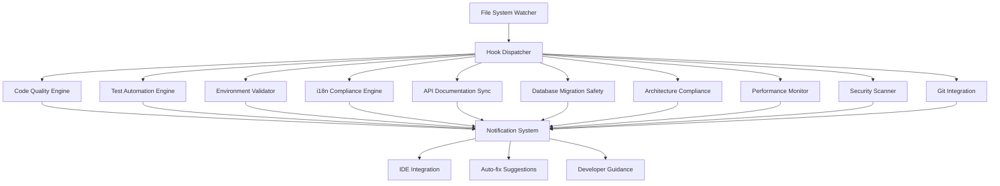
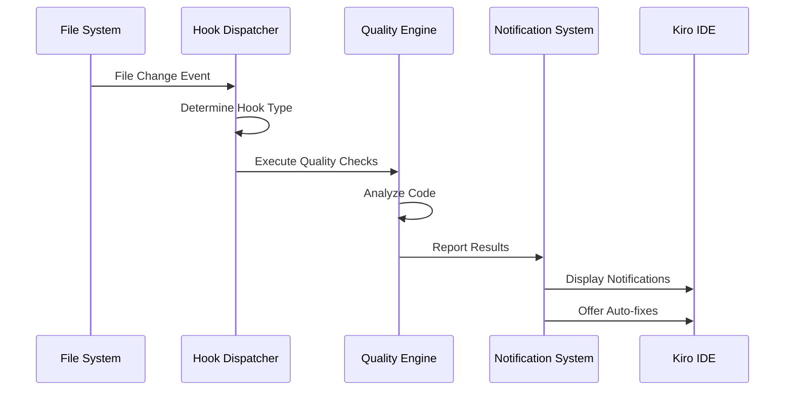
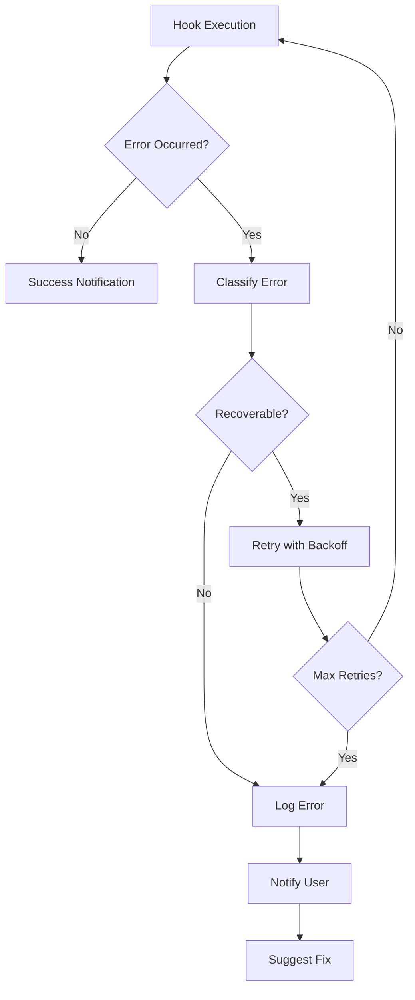

# Development Automation Hooks Design

## Overview

The Development Automation Hooks system is designed as a comprehensive suite of intelligent agent hooks that integrate seamlessly with the Kiro IDE to automate quality assurance, testing, and development workflow tasks for AnythingLLM. The system leverages file system watchers, AST parsing, and intelligent analysis to provide real-time feedback and automation throughout the development lifecycle.

## Architecture

### Core Components



### Hook Execution Flow



## Components and Interfaces

### 1. Hook Configuration System

```typescript
interface HookConfig {
  id: string;
  name: string;
  description: string;
  triggers: FileTrigger[];
  actions: HookAction[];
  enabled: boolean;
  priority: number;
  debounceMs: number;
}

interface FileTrigger {
  patterns: string[];
  events: ('save' | 'create' | 'modify' | 'delete')[];
  excludePatterns?: string[];
}

interface HookAction {
  type: 'lint' | 'test' | 'validate' | 'format' | 'notify';
  config: Record<string, any>;
  async: boolean;
}
```

### 2. Code Quality Engine

```typescript
interface CodeQualityEngine {
  analyzeFile(filePath: string): Promise<QualityReport>;
  runLinter(filePath: string): Promise<LintResult[]>;
  checkI18nCompliance(filePath: string): Promise<I18nIssue[]>;
  formatCode(filePath: string): Promise<FormatResult>;
}

interface QualityReport {
  filePath: string;
  issues: QualityIssue[];
  suggestions: AutoFixSuggestion[];
  score: number;
}

interface QualityIssue {
  type: 'error' | 'warning' | 'info';
  message: string;
  line: number;
  column: number;
  rule: string;
  fixable: boolean;
}
```

### 3. Test Automation Engine

```typescript
interface TestAutomationEngine {
  findRelatedTests(filePath: string): Promise<string[]>;
  runTests(testPaths: string[]): Promise<TestResult>;
  generateTestTemplate(componentPath: string): Promise<string>;
  analyzeTestCoverage(filePath: string): Promise<CoverageReport>;
}

interface TestResult {
  passed: number;
  failed: number;
  skipped: number;
  failures: TestFailure[];
  duration: number;
}
```

### 4. Environment Validator

```typescript
interface EnvironmentValidator {
  validateNodeVersion(): Promise<ValidationResult>;
  checkPackageManager(): Promise<ValidationResult>;
  verifyEnvironmentFiles(): Promise<ValidationResult>;
  checkDevelopmentServices(): Promise<ServiceStatus[]>;
}

interface ValidationResult {
  valid: boolean;
  message: string;
  autoFixAvailable: boolean;
  fixAction?: () => Promise<void>;
}
```

### 5. i18n Compliance Engine

```typescript
interface I18nComplianceEngine {
  scanForHardcodedText(filePath: string): Promise<I18nIssue[]>;
  validateTranslationKeys(localeFiles: string[]): Promise<TranslationValidation>;
  suggestTranslationKeys(text: string): Promise<string[]>;
  generateMissingTranslations(keys: string[]): Promise<TranslationSuggestion[]>;
}

interface I18nIssue {
  text: string;
  line: number;
  column: number;
  suggestedKey: string;
  confidence: number;
}
```

## Data Models

### Hook Registry

```typescript
interface HookRegistry {
  hooks: Map<string, RegisteredHook>;
  activeWatchers: Map<string, FileWatcher>;
  executionQueue: HookExecution[];
}

interface RegisteredHook {
  config: HookConfig;
  engine: HookEngine;
  lastExecution: Date;
  executionCount: number;
  averageExecutionTime: number;
}

interface HookExecution {
  hookId: string;
  filePath: string;
  timestamp: Date;
  status: 'pending' | 'running' | 'completed' | 'failed';
  result?: HookResult;
}
```

### Configuration Storage

```typescript
interface HookSettings {
  globalEnabled: boolean;
  hooks: Record<string, HookConfig>;
  notifications: NotificationSettings;
  performance: PerformanceSettings;
}

interface NotificationSettings {
  showSuccessMessages: boolean;
  autoHideDelay: number;
  soundEnabled: boolean;
  desktopNotifications: boolean;
}
```

## Error Handling

### Error Classification

```typescript
enum ErrorSeverity {
  INFO = 'info',
  WARNING = 'warning',
  ERROR = 'error',
  CRITICAL = 'critical'
}

interface HookError {
  hookId: string;
  severity: ErrorSeverity;
  message: string;
  filePath?: string;
  stack?: string;
  timestamp: Date;
  recoverable: boolean;
}
```

### Error Recovery Strategies

1. **Graceful Degradation**: If a hook fails, continue with other hooks
2. **Retry Logic**: Implement exponential backoff for transient failures
3. **Fallback Actions**: Provide alternative actions when primary actions fail
4. **User Notification**: Always inform users of critical failures with actionable guidance

### Error Handling Flow



## Testing Strategy

### Unit Testing

1. **Hook Engine Tests**: Test individual hook engines in isolation
2. **Configuration Tests**: Validate hook configuration parsing and validation
3. **File Watcher Tests**: Test file system event handling
4. **Error Handling Tests**: Verify error recovery mechanisms

### Integration Testing

1. **End-to-End Hook Execution**: Test complete hook workflows
2. **IDE Integration Tests**: Verify proper integration with Kiro IDE
3. **Performance Tests**: Ensure hooks don't impact IDE performance
4. **Concurrent Execution Tests**: Test multiple hooks running simultaneously

### Test Data and Mocking

```typescript
interface MockFileSystem {
  createFile(path: string, content: string): void;
  modifyFile(path: string, content: string): void;
  deleteFile(path: string): void;
  triggerEvent(event: FileSystemEvent): void;
}

interface TestHookConfig {
  minimal: HookConfig;
  complex: HookConfig;
  invalid: HookConfig;
}
```

## Performance Considerations

### Optimization Strategies

1. **Debouncing**: Prevent excessive hook executions during rapid file changes
2. **Caching**: Cache analysis results for unchanged files
3. **Lazy Loading**: Load hook engines only when needed
4. **Background Processing**: Run non-critical hooks asynchronously
5. **Resource Limits**: Implement timeouts and memory limits for hook executions

### Performance Monitoring

```typescript
interface PerformanceMetrics {
  hookExecutionTimes: Map<string, number[]>;
  memoryUsage: MemoryUsageStats;
  fileWatcherPerformance: WatcherStats;
  queueLength: number;
}

interface PerformanceThresholds {
  maxExecutionTime: number;
  maxMemoryUsage: number;
  maxQueueLength: number;
}
```

## Security Considerations

### Code Execution Safety

1. **Sandboxing**: Execute hook code in isolated environments
2. **Permission Validation**: Verify hooks have necessary permissions
3. **Input Sanitization**: Sanitize all file paths and content
4. **Resource Limits**: Prevent hooks from consuming excessive resources

### Data Protection

1. **Sensitive Data Detection**: Avoid logging sensitive information
2. **Secure Storage**: Encrypt hook configurations if they contain secrets
3. **Access Control**: Implement proper access controls for hook management

## Implementation Phases

### Phase 1: Core Infrastructure
- Hook registry and configuration system
- File system watcher implementation
- Basic notification system
- Simple code quality hooks (ESLint integration)

### Phase 2: Essential Hooks
- Test automation hooks
- i18n compliance checking
- Environment validation
- Basic performance monitoring

### Phase 3: Advanced Features
- API documentation synchronization
- Database migration safety
- Architecture compliance checking
- Security scanning integration

### Phase 4: Optimization and Polish
- Performance optimization
- Advanced error recovery
- Comprehensive testing
- Documentation and user guides

## Configuration Examples

### Basic Code Quality Hook

```json
{
  "id": "code-quality-basic",
  "name": "Basic Code Quality Check",
  "description": "Runs ESLint and Prettier on JavaScript/JSX files",
  "triggers": [
    {
      "patterns": ["**/*.{js,jsx,ts,tsx}"],
      "events": ["save"],
      "excludePatterns": ["**/node_modules/**", "**/dist/**"]
    }
  ],
  "actions": [
    {
      "type": "lint",
      "config": {
        "tool": "eslint",
        "autoFix": true
      },
      "async": false
    },
    {
      "type": "format",
      "config": {
        "tool": "prettier"
      },
      "async": false
    }
  ],
  "enabled": true,
  "priority": 1,
  "debounceMs": 500
}
```

### Test Automation Hook

```json
{
  "id": "test-automation",
  "name": "Automated Testing",
  "description": "Runs related tests when components are modified",
  "triggers": [
    {
      "patterns": ["**/src/components/**/*.{js,jsx}"],
      "events": ["save", "create"],
      "excludePatterns": ["**/__tests__/**"]
    }
  ],
  "actions": [
    {
      "type": "test",
      "config": {
        "findRelated": true,
        "coverage": false,
        "watch": false
      },
      "async": true
    }
  ],
  "enabled": true,
  "priority": 2,
  "debounceMs": 1000
}
```

This design provides a comprehensive, scalable, and maintainable foundation for implementing development automation hooks that will significantly improve the AnythingLLM development experience.